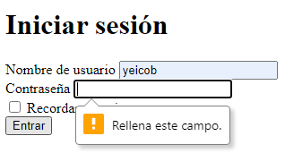

# EJERCICIO HTML EN CLASE

En este repositorio se encontrará un ejercicio que nos pondrá el profesor en la
clase del Viernes, 27 de AGOSTO.

> Subirá el ejercicio a las 6 PM, y se podrá entregar hasta las 11:59 PM.

## INSTRUCCIONES

Crear dos páginas siguiendo las imágenes adjuntas:

1. Login con formulario básico (poner campos de nombre de usuario y contraseña
   como requeridos)


2. Tabla con mezcla de renglones y columnas


Para la segunda pantalla pegar en siguiente código en el HEAD para que se puedan
visualizar los bordes de la tabla y ver que efectivamente se hizo bien

```html
<style>
  table,
  th,
  td {
    border-collapse: collapse;
    border: solid 1px black;
  }
</style>
```

Subir el código al repositorio (link en la clase de ayer)

Subir aquí una captura de su repositorio con el último commit

## RESULTADOS

1. Login con formulario básico (poner campos de nombre de usuario y contraseña
   como requeridos)

   
   
   
   

2. Tabla con mezcla de renglones y columnas

   Esta era la tabla que terminé inicialmente:

   

   Después agregué los demás elementos y la terminé en su totalidad.

   
   
   
